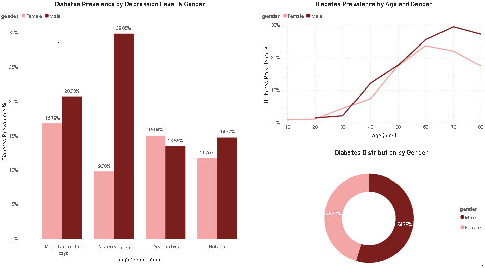

# Diabetes Prevalence Analysis Dashboard (Power BI + R + SQL)

This project explores the relationship between diabetes prevalence, age, gender, and depression levels using NHANES data.

## Project Workflow
1. Collected NHANES health datasets (demographics, depression survey, clinical indicators)
2. Cleaned and structured raw data using SQL (data extraction, filtering, joins)
3. Processed and analyzed data in R
4. Performed exploratory data analysis to identify trends
5. Built an interactive Power BI dashboard for visualization
6. Generated key population health insights

## Key Insights
- Diabetes prevalence increases with age across both genders
- Higher prevalence observed among individuals reporting frequent depressive symptoms
- Noticeable variation across gender groups

## Tools Used
- SQL (Data extraction, cleaning, joins)
- R (Data analysis & visualization)
- Power BI (Dashboard development)

## Dashboard Preview

